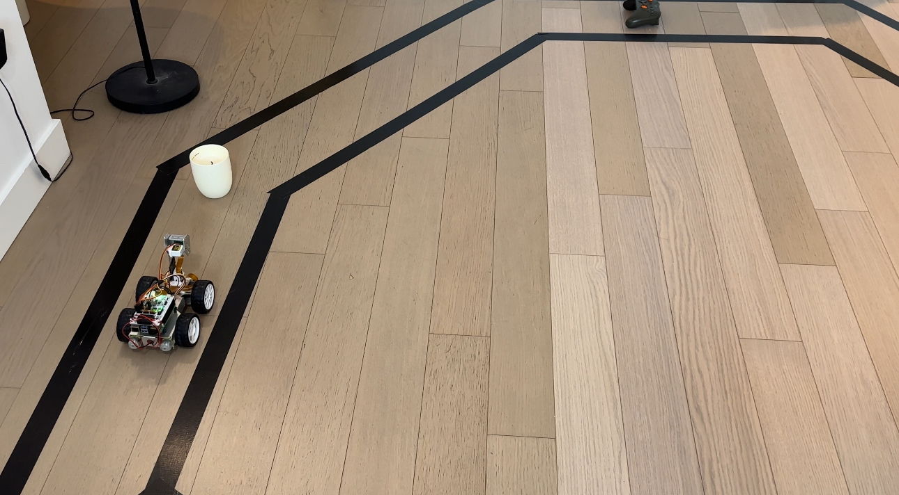

This is a README file

## Project Overview
**This repository contains my Vision-based Real-time autopilot system project. The hardware component of this project was based on the SunFounder Picar with minor modifications, including raising the camera a bit for a better view. The goal is to let the car follow a lane marked by black tape on the floor. When it sees obstacles, like a Coke can placed along the path, the car should avoid them and return to the lane.**

**The following lists all files this repo contains, along with their discriptions.**

----

#### carcontroller.py
This is the file that only use to controll the toy car usig the XBOX joystick.

#### collect_data.py
We uses this python script to collect our training data. As we drove, data was recorded at 10 frames per second. Each image was saved alongside a .csv file containing the corresponding controller input, all in the same folder.

#### Train.ipynb
We uses this .ipynb script to train our model on _Google Colab_.

#### predict_rpi_test.py
This python script is for testing purpose. It checks the training data saved in the folder and directly performs predictions based on the model file. This is used to ensure that the model file is functioning the same way as we train & validate it.

#### predict_rpi_32.py
This file is used for the Raspberry PI to perform self driving using **model_fp32_model.tflite**, which is the model_file we obtained after perform training on _Google Colab_. This is a model with full-precision. 

#### predict_rpi.py
This file is used for the Raspberry PI to perform self driving using **model_int8.tflite**, which is the model_file we obtained after perform training on _Google Colab_. This is a model after quantization.

#### predict_rpi_obstacle.py
This file is the version of **predict_rpi_32.py** with obstacle avoidance algorithm added to it.

 
 

----

Note that the following files are mainly used for the Edge Impulse, which we stop using after finding that edge impulse has the following two inherite problem which we are not able to solve:
1. First, although we selected RGB format for the image processing module, the generated model appeared to only accept grayscale image data. To try to solve this issue, we wrote **collect_data_pre_process.py**. 
2. Second, we noticed discrepancies between the predictions made by the exported model and those shown in Edge Impulse, even when using the same input data. This is checked by using **self_driving_test.py**. 

#### self_driving.py
This file is used for the Raspberry PI to perform self driving using **model1.eim**, which is the model_file we obtained after perform training on _Edge Impulse_.

#### collect_data_pre_process.py
We use this python script to process the image to 96 by 96 grayscale such that we can skip the image processing step on Edge Impulse as in case they use a different squash format than our local platforms. This is done to ensure consistensy between Edge Impulse and RPI.

#### self_driving_test.py
This python script is for testing purpose for the mdoel file generated by _Edge Impulse_. It checks the training data saved in the folder and directly performs predictions based on the model file. This is used to ensure that the model file is functioning the same way as we train & validate it.

